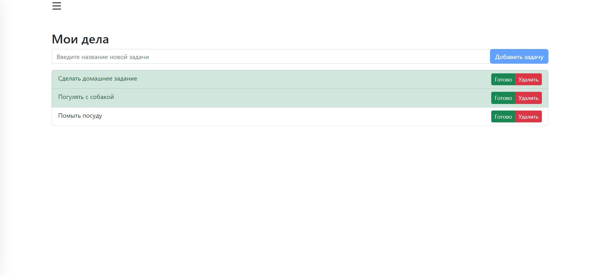

# Todo-JsApp
Todo list on vanilla JavaScript



## Getting start
For the todo sheet to work, you need to start the server via cmd.  

In the command line, enter 
```node index.js ```

and the server will be successfully launched, the application will work.
